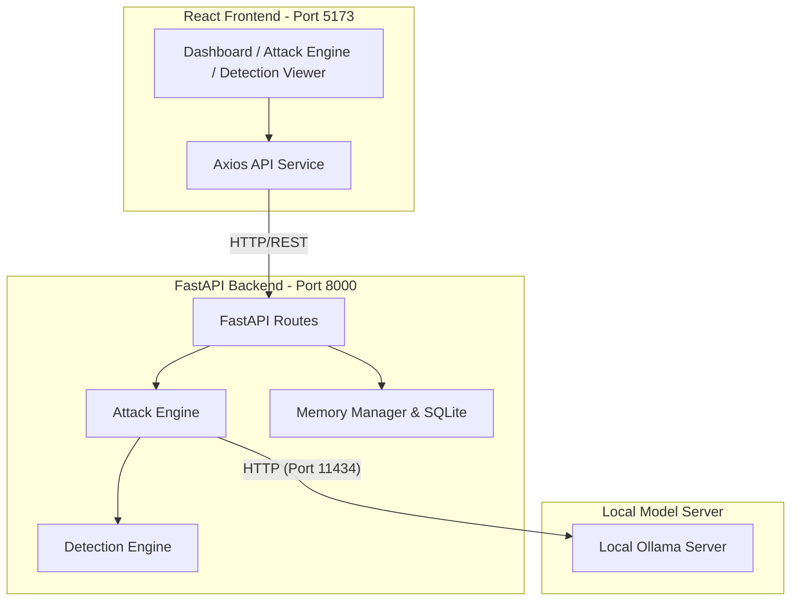

# AI Security Testing Platform & Command Center


This project is a modular **AI Security Testing Platform** built with Python, FastAPI, and a local Ollama model, coupled with a premium, responsive React-based dashboard frontend. It is designed to rigorously test, attack, and detect vulnerabilities in Large Language Models (LLMs) through an automated execution pipeline.

---

## 🎯 Project Overview & Features

*   **AI Chat Interface**: A conversational playground to interact directly with the locally hosted LLM.
*   **Attack Engine**: Automated adversarial testing environment to run prompt injections, jailbreaks, and memory extraction attacks against the LLM.
*   **Detection Engine**: A robust security analyzer that intercepts AI responses to identify data leakage, policy violations, and successful exploits.
*   **Attack Library**: A registered suite of adversarial prompts categorized by severity.
*   **REST API**: A fully decoupled FastAPI layer exposing all security engine capabilities.
*   **Live Frontend Integration**: Real-time status monitoring, attack execution, and threat detection reporting.
*   **Conversation Memory**: SQLite-backed persistent context and conversation tracking.
*   **Dashboard**: A security command center for system analytics and platform health monitoring.

---

## 🏗️ Architecture & Workflow

### Component Architecture

The platform operates across three main tiers:



### Current Execution Workflow

When a security assessment is triggered, data flows through the following automated pipeline:

```text
User
  ↓
Frontend (Initiates Attack)
  ↓
FastAPI (Receives Payload)
  ↓
Ollama (Generates LLM Response)
  ↓
Attack Engine (Coordinates Execution)
  ↓
Detection Engine (Analyzes Output)
  ↓
Detection Report (Aggregates Results)
  ↓
Frontend Dashboard (Visualizes Threat Analysis)
```

---

## 🚀 Modules Status

### Completed Modules
*   ✅ **Module 1 – AI Agent**: LLM integration, conversational memory, basic APIs.
*   ✅ **Module 2 – Attack Engine**: Adversarial prompt registry, execution pipeline, batch processing.
*   ✅ **Module 3 – Detection Engine & Frontend Integration**: Threat detectors (Jailbreak, Canary, Prompt Leakage), live UI execution, visual reporting.

### Roadmap
*   🚧 **Module 4 – Evidence Collection & Forensics**: Granular artifact logging, proof-of-exploit generation.
*   🚧 **Module 5 – Analytics & Reporting**: Trend analysis, PDF report generation, historical security metrics.

---

## 🔌 API Reference

The backend exposes a clean REST interface for system integrations:

| Method | Endpoint | Description |
| :--- | :--- | :--- |
| `GET` | `/health` | Returns API status and system health |
| `POST` | `/chat` | Sends a prompt to the LLM and returns the response |
| `GET` | `/api/attacks` | Retrieves the registered Attack Library |
| `POST` | `/api/attacks/run` | Executes a specific attack by ID |
| `POST` | `/api/attacks/run-all` | Executes all enabled attacks sequentially |

---

## 🛠️ Technology Stack

**Backend**
*   **FastAPI** (Routing & API layer)
*   **Ollama** (Local LLM execution)
*   **Pydantic** (Data validation & schemas)
*   **Pytest** (Automated testing framework)
*   **SQLite** (Persistent memory storage)

**Frontend**
*   **React 19** (Component-based UI)
*   **TypeScript** (Static typing)
*   **Vite** (Next-generation build tool)
*   **Axios** (HTTP client)
*   **Lucide React** (Iconography)

---

## ⚙️ Setup & Installation

### 1. Prerequisites
*   Python 3.10+
*   Node.js 18+ & npm
*   [Ollama](https://ollama.com/) (Installed and running locally)

### 2. Backend Setup
1. **Activate virtual environment**:
    ```bash
    python3 -m venv .venv
    source .venv/bin/activate
    ```
2. **Install dependencies**:
    ```bash
    pip install -r requirements.txt
    ```
3. **Pull the LLM model**:
    ```bash
    ollama pull qwen3
    ```
4. **Launch the FastAPI backend server**:
    ```bash
    uvicorn app.main:app --host 127.0.0.1 --port 8000
    ```

### 3. Frontend Setup
1. **Navigate to the frontend directory**:
    ```bash
    cd frontend
    ```
2. **Install dependencies**:
    ```bash
    npm install
    ```
3. **Start the development server**:
    ```bash
    npm run dev
    ```
4. **Access the application**: Navigate to `http://localhost:5173` in your browser.

---

## 📂 Project Structure

```text
AI-Security-/
├── app/                      # Python FastAPI Backend
│   ├── attack_engine/        # Adversarial attack execution logic
│   ├── detection/            # Threat detection & analysis plugins
│   ├── routes/               # API endpoint definitions
│   ├── main.py               # Application entrypoint
│   └── ...
├── frontend/                 # React Web Application
│   ├── src/
│   │   ├── api/              # Axios configuration
│   │   ├── components/       # Reusable UI elements (GlassCard, DataTable, etc.)
│   │   ├── pages/            # Views (Dashboard, AttackEngine, Detection, Chat)
│   │   ├── services/         # Execution store & API calls
│   │   └── ...
├── tests/                    # 130+ passing pytest backend tests
├── memory.db                 # Auto-generated SQLite memory store
├── requirements.txt          # Python dependencies
└── package.json              # Node dependencies (in frontend/)
```

---

## 📸 Screenshots

*(Placeholders for future application screenshots)*

*   **Dashboard**: System overview and active connections.
*   **Attack Engine**: Execution grid, live testing, and history cache.
*   **Detection Viewer**: Threat analysis reports, severity breakdowns.
*   **Chat**: Interactive LLM conversation interface.

---

## 🧪 Testing

Run the full backend test suite to verify the engines and endpoints:

```bash
pytest
```

The test suite thoroughly covers execution timeouts, schema validations, memory integrations, and isolated detector logic.

---

## 📝 License

This project is licensed under the MIT License. See the LICENSE file for details.
