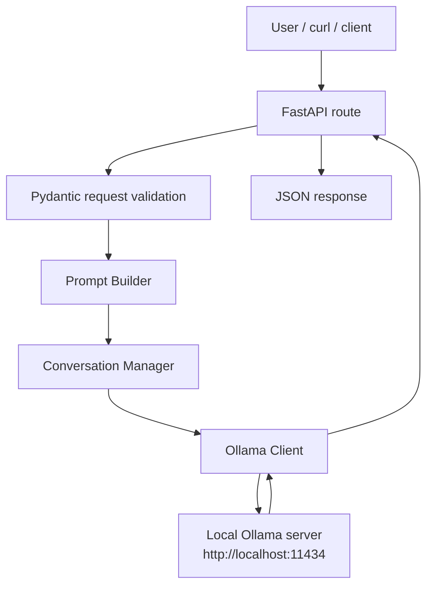

# AI Agent Module 1

This project is a beginner-friendly AI agent backend built from scratch with Python, FastAPI, and a local Ollama model.
The code is intentionally small and modular so students can learn one idea at a time.

## Project Overview

The application exposes two HTTP endpoints:

- `GET /health` to confirm the API is running
- `POST /chat` to send a message to the local Ollama model and get a reply

The main goal of Module 1 is to keep the backend clean, readable, and easy to extend later without major rewrites.

## Architecture Diagram



## Folder Structure

```text
AI-Agent/
├── app/
│   ├── __init__.py
│   ├── main.py
│   ├── routes.py
│   ├── config.py
│   ├── schemas.py
│   ├── prompts.py
│   ├── conversation.py
│   ├── ollama_client.py
│   ├── logging_utils.py
│   ├── error_handlers.py
│   └── utils.py
├── logs/
├── tests/
├── requirements.txt
├── .gitignore
├── README.md
└── explaination
```

## Installation

Create and activate a virtual environment:

```bash
python3.12 -m venv venv
source venv/bin/activate
```

Install dependencies:

```bash
pip install -r requirements.txt
```

## Running Ollama

Make sure Ollama is installed and running locally.

Pull the model if needed:

```bash
ollama pull qwen3
```

If your local install exposes the model as `qwen3:8b`, the app already supports that fallback.

## Running FastAPI

Start the API server:

```bash
uvicorn app.main:app --reload
```

The server will usually run at `http://127.0.0.1:8000`.

## Example API Calls

### Health check

```bash
curl http://127.0.0.1:8000/health
```

Expected response:

```json
{
	"status": "running"
}
```

### Chat request

```bash
curl -X POST http://127.0.0.1:8000/chat \
	-H "Content-Type: application/json" \
	-d '{"message":"Hello"}'
```

Example response:

```json
{
	"response": "Hello! How can I help you today?"
}
```

## Common Errors

- If `GET /health` fails, check that Uvicorn is running.
- If `POST /chat` returns `503`, confirm that Ollama is running on port `11434`.
- If the model name is not found, the app tries the configured fallback model `qwen3:8b`.
- If validation fails, the API returns a friendly `422` response with readable error messages.
- If Python packages are missing, run `pip install -r requirements.txt` again inside the virtual environment.

## How the Request Travels

When you call `POST /chat`, FastAPI first validates the JSON body using Pydantic.
The route then asks the Prompt Builder to create the final Ollama message list.
The Prompt Builder reads the current conversation history from the Conversation Manager and adds the newest user message.
The Ollama Client sends the final payload to the local Ollama server and returns the assistant reply.
The route stores the latest user and assistant messages back into the Conversation Manager so short chat history is preserved in memory.

## How Each Part Works

### Configuration

`app/config.py` holds all configurable values in one place.
That includes the Ollama URL, model name, system prompt, history size, timeout, log level, API title, API version, and log file settings.

### Prompt Builder

`app/prompts.py` contains `PromptBuilder`.
It builds the message list in the exact order Ollama expects:

1. system prompt
2. previous conversation messages
3. newest user message

This keeps prompt logic out of the route layer.

### Conversation Manager

`app/conversation.py` contains `ConversationManager`.
It stores messages only in memory and keeps only the latest configured number of messages.
That prevents unlimited growth while still allowing short chat context.

### Ollama Communication

`app/ollama_client.py` is the only file that talks to Ollama with `requests.post()`.
It handles connection errors, timeouts, invalid JSON, empty responses, and model fallback behavior.

### Logging

`app/logging_utils.py` configures built-in Python logging.
Logs are written to the `logs/` folder and also shown in the console.
The app logs startup, requests, user messages, AI responses, execution time, warnings, and errors.

### Error Handling

`app/error_handlers.py` converts FastAPI and unexpected exceptions into user-friendly JSON responses.
That keeps the API responses simple for beginners and easier to understand.

## Testing

Run the tests with:

```bash
pytest
```

The tests cover:

- `GET /health`
- `POST /chat` success
- missing message field
- empty message
- Ollama unavailable
- `ConversationManager`
- `PromptBuilder`

## Future Roadmap

Later modules can build on this foundation without major refactoring.
Possible next steps are:

1. long-term memory
2. tool calling
3. RAG
4. security and attack detection
5. multi-agent communication
6. richer logging and analytics

## Git Commands

Use these commands for this stage:

```bash
git status
git add .
git commit -m "Complete Module 1 AI Agent foundation"
git push
```
