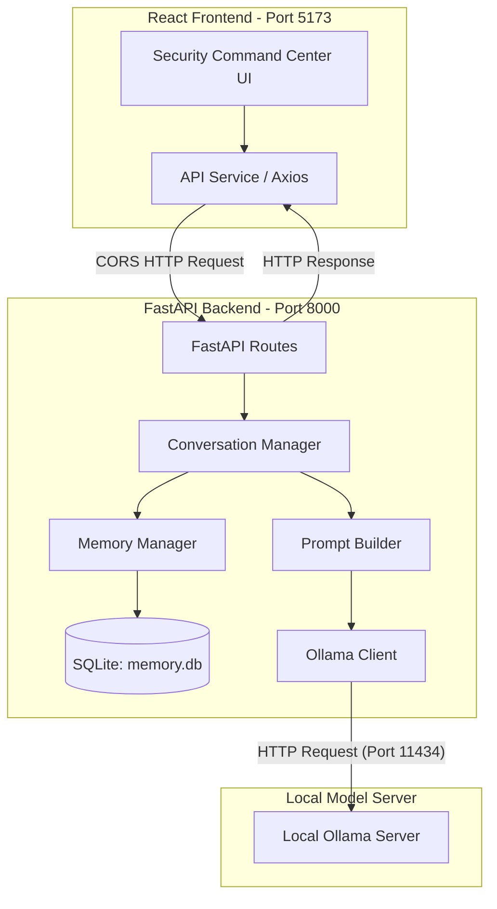

# AI Security Agent & Command Center

This project is a beginner-friendly, modular AI security agent backend built with Python, FastAPI, and a local Ollama model, coupled with a premium, responsive React-based dashboard frontend. It features a SQLite-backed memory system, automated pytest coverage, graceful fallback behaviors when the AI service is offline, and a comprehensive security command center UI.

---

## Architecture Overview

The system consists of two major parts:
1. **FastAPI Backend**: Exposes endpoints for agent interaction (`POST /chat`) and health checks (`GET /health`), manages short-term conversation context, saves/retrieves persistent memory via SQLite, and communicates with a local Ollama server.
2. **React Frontend (Vite + TypeScript)**: A modern security command center dashboard offering real-time status monitoring, an interactive chatbot interface, attack library pages, detection status tracking, forensic logs, and system analytics.



---

## Project Structure

```text
AI-Security-/
├── app/                      # Python FastAPI Backend Source Code
│   ├── __init__.py
│   ├── config.py             # Central application configuration & settings
│   ├── conversation.py       # Conversation history & context manager
│   ├── database.py           # SQLite connection & schema initialization
│   ├── error_handlers.py     # Friendly FastAPI error formatting
│   ├── logging_utils.py      # Console and file logging configuration
│   ├── main.py               # FastAPI application entrypoint & middleware (CORS)
│   ├── memory_manager.py     # CRUD operations for SQLite-based persistent memory
│   ├── ollama_client.py      # Local Ollama LLM integration & error handling
│   ├── prompts.py            # System prompts & final prompt compilation
│   ├── routes.py             # API route definitions (/health, /chat)
│   ├── schemas.py            # Pydantic request/response models
│   └── utils.py              # Performance/timing & formatting helpers
├── frontend/                 # React Web Application (Vite + TypeScript)
│   ├── src/
│   │   ├── api/              # Axios API instance configuration
│   │   ├── assets/           # UI media assets
│   │   ├── components/       # Layout components & common UI buttons, cards, and tables
│   │   │   └── common/       # Modular, reusable premium UI elements
│   │   ├── layouts/          # Main application shell with collapsible Sidebar & TopNav
│   │   ├── mock/             # Simulated data for security features
│   │   ├── pages/            # View components (Dashboard, Chat, Attack Engine, Analytics, etc.)
│   │   ├── services/         # Frontend business services communicating with FastAPI
│   │   ├── styles/           # CSS design tokens, animations, and global rules
│   │   ├── types/            # TypeScript definitions for model structures
│   │   ├── App.tsx           # Route declarations and main component structure
│   │   ├── index.css         # Base stylesheet
│   │   └── main.tsx          # React application mount script
│   ├── package.json          # Node dependencies and scripts
│   ├── vite.config.ts        # Vite build configuration
│   └── README.md             # Vite project description
├── logs/                     # Auto-generated application logs
├── tests/                    # pytest backend tests
├── README.md                 # Main project README (this file)
├── explaination              # Beginner-friendly project walkthrough
├── memory.db                 # SQLite memory database (auto-generated)
├── requirements.txt          # Backend Python dependencies
└── .gitignore                # Git exclusions file
```

---

## Tech Stack

### Backend Technologies
*   **FastAPI**: Fast, asynchronous web framework for building APIs with Python.
*   **Uvicorn**: Lightning-fast ASGI server implementation for running FastAPI.
*   **SQLite**: Serverless, file-based SQL database for persistent agent memory.
*   **Ollama**: Engine to run open-source large language models (like `qwen3` or `qwen3:8b`) locally.
*   **Pytest**: Comprehensive automated testing framework.

### Frontend Technologies
*   **React 19**: Modern component-based web interface framework.
*   **Vite**: Next-generation front-end tooling for extremely fast development builds.
*   **TypeScript**: Static typing for safer, cleaner code structure.
*   **Axios**: Promise-based HTTP client for calling the backend.
*   **Lucide React**: Premium icon set for consistent visual style.
*   **Vanilla CSS**: Premium dark-mode security UI using CSS variables, custom grid/flex layouts, glassmorphism design, and animations.

---

## Setup & Running the Application

### 1. Prerequisites
*   Python 3.10+
*   Node.js 18+ & npm
*   Ollama (installed and running locally)

---

### 2. Backend Setup & Run

1. **Activate virtual environment**:
    ```bash
    python3 -m venv .venv
    source .venv/bin/activate
    ```

2. **Install dependencies**:
    ```bash
    pip install -r requirements.txt
    ```

3. **Ensure Ollama is running**:
    Make sure Ollama is installed. If needed, pull the default model:
    ```bash
    ollama pull qwen3
    ```
    The application will automatically attempt fallback to `qwen3:8b` or a generic message if Ollama is unresponsive.

4. **Launch the FastAPI backend server**:
    ```bash
    uvicorn app.main:app --host 127.0.0.1 --port 8000
    ```

5. **Verify the backend** (optional):
    ```bash
    curl http://127.0.0.1:8000/health
    # Output: {"status":"running"}
    ```

---

### 3. Frontend Setup & Run

1. **Navigate to the frontend directory**:
    ```bash
    cd frontend
    ```

2. **Install node dependencies**:
    ```bash
    npm install
    ```

3. **Start the development server**:
    ```bash
    npm run dev
    ```
    This will start Vite on [http://localhost:5173](http://localhost:5173).

4. **Access the application**:
    Open your browser and navigate to `http://localhost:5173`. The UI will establish a connection to your running FastAPI backend.

---

## Detailed Features

### 1. Security Command Center (Dashboard)
*   **Real-time Status**: Displays connection indicators for both the FastAPI backend and local Ollama model.
*   **System Overview**: Provides metadata about platform version, model name, active databases, and system uptime.
*   **Recent Activity Log**: An animated timeline showing security-related operations, initialization steps, and database connectivity logs.

### 2. Interactive AI Chat
*   A premium, clean interface featuring user and assistant message bubbles.
*   Shows a visual loading state (`Sending...` pulse animation) while waiting for the local LLM.
*   Stores short-term conversation context in memory to keep historical message consistency.

### 3. Memory & Persistent Database
*   **SQLite Integration**: Memories are persistently stored in the root directory within a database called `memory.db`.
*   **Database Schema (`memories` table)**:
    *   `id`: Primary key.
    *   `memory`: Stored text block.
    *   `created_at`: Creation timestamp.
    *   `updated_at`: Timestamp of the last update.
*   **Automatic Cleanup**: If you need to clear the memory database, delete `memory.db` and restart the backend:
    ```bash
    rm memory.db
    ```

### 4. Advanced Security Pages (Simulated Engine)
*   **Attack Engine**: An overview of 8 adversarial attack vectors categorized by severity (Critical, High, Medium, Low), including an execution history table.
*   **Detection**: Visual interfaces mapping detected security vulnerabilities.
*   **Evidence & Forensics**: Read-only tracking and investigation tables representing proof of malicious operations.
*   **Analytics**: Graphic visualization panels for performance statistics.

---

## Testing

Backend test coverage is written using `pytest`. Run the full backend test suite with:

```bash
pytest
```

The test coverage covers:
*   FastAPI health endpoint behavior
*   Chat endpoint validation & schema formatting
*   SQLite memory manager CRUD operations
*   FastAPI integration with memory persistence
*   Ollama client timeouts and service fallback handlers

---

## Git Workflow

To save your work and update the shared codebase:

```bash
git status
git add .
git commit -m "Your description of updates"
git push origin main
```
