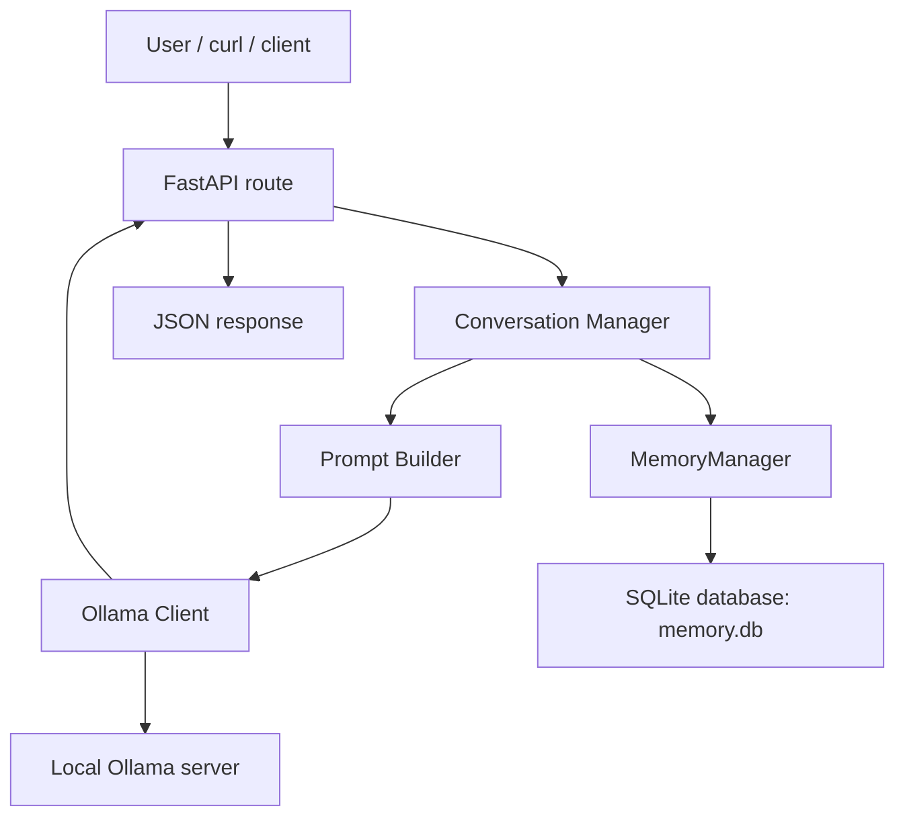

# AI Agent Project

This project is a beginner-friendly AI agent backend built with Python, FastAPI, and a local Ollama model. It now also includes a SQLite-backed memory system, automated pytest coverage, and graceful fallback behavior when the AI service is unavailable.

## Project Overview

The application exposes two primary HTTP endpoints:

- `GET /health` to confirm that the API is running
- `POST /chat` to send a user message to the application and receive a response

The project is intentionally modular so students can learn one concept at a time without a large framework layer.

## Current Features

- FastAPI application with startup and request logging
- Input validation with Pydantic models
- Conversation history handling
- SQLite-based memory storage and retrieval
- Memory search, update, delete, and load operations
- Fallback response when Ollama is slow or unavailable
- Automated tests with pytest

## Architecture Summary



## Project Structure

```text
AI-Security/
├── app/
│   ├── __init__.py
│   ├── config.py
│   ├── conversation.py
│   ├── database.py
│   ├── error_handlers.py
│   ├── logging_utils.py
│   ├── main.py
│   ├── memory_manager.py
│   ├── ollama_client.py
│   ├── prompts.py
│   ├── routes.py
│   ├── schemas.py
│   └── utils.py
├── logs/
├── tests/
├── README.md
├── explaination
├── memory.db
├── requirements.txt
└── .gitignore
```

## Setup

### 1. Create and activate a virtual environment

```bash
python3 -m venv .venv
source .venv/bin/activate
```

### 2. Install dependencies

```bash
pip install -r requirements.txt
```

## Run Ollama

Make sure Ollama is installed and running locally.

If needed, pull the model:

```bash
ollama pull qwen3
```

The application also supports the fallback model `qwen3:8b`.

## Run the Application

Start the FastAPI server:

```bash
uvicorn app.main:app --host 127.0.0.1 --port 8000
```

Then test it with:

```bash
curl http://127.0.0.1:8000/health
```

and

```bash
curl -X POST http://127.0.0.1:8000/chat \
  -H "Content-Type: application/json" \
  -d '{"message":"Hello"}'
```

## API Behavior

### Health endpoint

`GET /health`

Returns:

```json
{"status": "running"}
```

### Chat endpoint

`POST /chat`

Accepts a JSON body like:

```json
{"message": "Hello"}
```

Returns a response body like:

```json
{"response": "..."}
```

If Ollama is slow or unavailable, the app returns a fallback response instead of failing the request.

## Module 2 Memory System

The project uses SQLite for persistent memory storage.

### What SQLite does here

SQLite stores memory records in a local database file named `memory.db` in the project root. The database is created automatically when the application starts and the schema is initialized through the database module.

### Why SQLite is used

SQLite is a lightweight, file-based database that is simple to use for local development and testing. It does not require a separate server process.

### How memories are stored

Memories are stored in a table named `memories` with these columns:

- `id`: primary key
- `memory`: the stored text
- `created_at`: timestamp for creation
- `updated_at`: timestamp for the last update

### How memories are retrieved

The memory manager supports:

- loading all memories
- loading a limited number of most recent memories
- searching by partial, case-insensitive text match
- updating an existing memory record
- deleting a memory record

### Database file location

The current database path is:

```text
memory.db
```

### Resetting memory

To clear saved memories, remove the database file and restart the app:

```bash
rm memory.db
```

The app will recreate the database file on the next startup.

## Logging

The application uses Python’s built-in logging system. Logs are written to the `logs/` directory and also sent to the console.

The logging setup covers startup, requests, warnings, errors, and response handling.

## Testing

Run the full test suite with:

```bash
pytest
```

The current test suite covers:

- health endpoint behavior
- chat endpoint behavior
- validation errors
- Ollama timeout and connection fallback behavior
- conversation history handling
- prompt building
- memory manager CRUD behavior
- integration flow for memory persistence

## Known Limitations

- The memory system is currently simple and file-based; it does not expose dedicated REST endpoints for managing memories.
- Memory saving is still controlled by the conversation-layer importance check, which is intentionally basic.
- The chat flow depends on a working local Ollama installation for the best experience.

## Git Workflow

Typical commands:

```bash
git status
git add .
git commit -m "Describe your changes"
git push
```
git push
```
