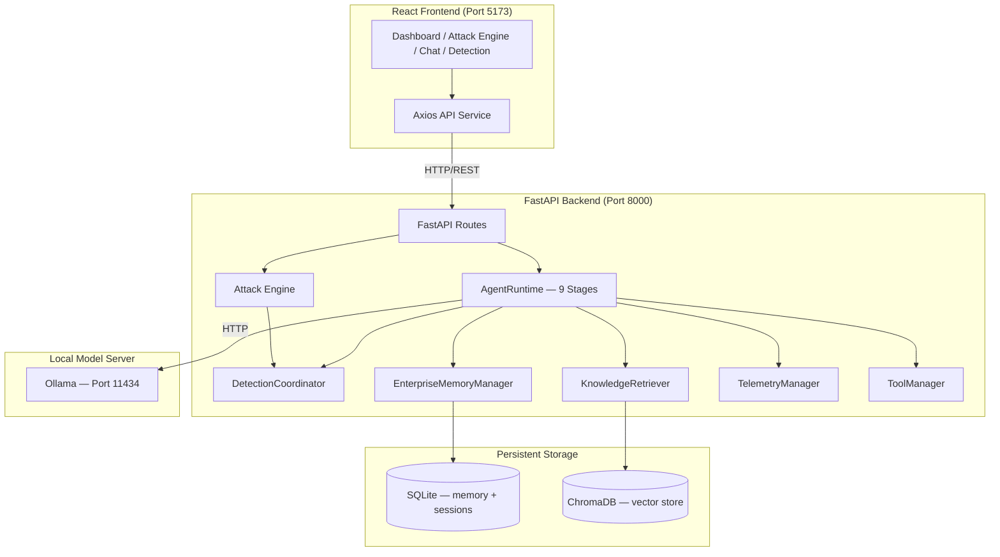

# AI Security Testing Platform — Module 1 Final Architecture


A modular **AI Security Testing Platform** built on FastAPI, Ollama, and a React/TypeScript frontend. It is engineered to rigorously test, attack, and detect vulnerabilities in Large Language Models through an automated staged execution pipeline backed by enterprise-grade memory and knowledge retrieval subsystems.

---

## 🎯 Features

| Feature | Description |
|:--------|:------------|
| **AI Chat Interface** | Conversational playground wired directly to the hosted LLM |
| **Attack Engine** | Automated adversarial testing — injections, jailbreaks, canary extractions |
| **Detection Engine** | Multi-detector pipeline (Jailbreak, Canary, Prompt Leakage) |
| **Attack Library** | Registered suite of adversarial prompts by category and severity |
| **REST API** | Fully decoupled FastAPI backend exposing all capabilities |
| **Live Frontend Integration** | Real-time attack execution and detection reporting |
| **Enterprise Memory** | SQLite-backed session-isolated memory with importance scoring |
| **RAG / Knowledge Retrieval** | ChromaDB vector store + sentence-transformer embeddings |
| **Staged Runtime Pipeline** | 9-stage AgentRuntime with per-stage telemetry |
| **Admin APIs** | Telemetry, diagnostics, knowledge indexing, debug snapshots |
| **Dashboard** | Security command centre for analytics and platform health |

---

## 🏗️ Module 1 Final Architecture

### Runtime Pipeline

Every request through `AgentRuntime` is executed as a sequential staged pipeline:

```text
User Request
      │
      ▼
 [Stage 1] Context Preparation   — load conversation history + tool registry
      │
      ▼
 [Stage 2] Session Management    — create/load session via SessionManager
      │
      ▼
 [Stage 3] Memory Retrieval      — query EnterpriseMemoryManager (SQLite)
      │
      ▼
 [Stage 4] Knowledge Retrieval   — ChromaDB vector search via KnowledgeRetriever
      │
      ▼
 [Stage 5] Capability Resolution — route to NONE / FILESYSTEM_TOOL / RAG / DATABASE
      │
      ▼
 [Stage 6] Tool Execution        — ToolManager.execute_capability()
      │
      ▼
 [Stage 7] Prompt Building       — inject memories, knowledge chunks, tool output
      │
      ▼
 [Stage 8] Model Inference       — Ollama LLM (sync / async / streaming)
      │
      ▼
 [Stage 9] Detection Pipeline    — DetectionCoordinator (Jailbreak + Canary + Leakage)
      │
      ▼
  AgentResponse → Frontend Dashboard
```

### Enterprise Memory Subsystem

```
EnterpriseMemoryManager
  ├── SessionManager        — in-memory session lifecycle tracking
  ├── MemoryStorage         — SQLite (enterprise_memories table, partitioned by session_id)
  ├── ImportanceEngine      — EnterpriseImportanceScorer (keyword + heuristic scoring)
  └── MemoryRetriever       — importance + keyword ranked retrieval
```

### RAG (Knowledge) Subsystem

```
KnowledgeIndexer
  └── reads enterprise_sandbox/   (markdown / text knowledge files)
  └── chunks → embeds → ChromaDB vector store

KnowledgeRetriever
  └── embeds query → ChromaDB similarity search → top-k chunks
  └── injected into AgentRuntime at startup (no lazy instantiation)
```

### Dependency Injection at Startup

All services are constructed and wired together in `app/main.py` `lifespan`:

```
lifespan()
  ├── EnterpriseMemoryManager    → app.state.memory_manager
  ├── ConversationManager        → app.state.conversation_manager
  ├── PromptBuilder              → app.state.prompt_builder
  ├── TelemetryManager           → app.state.telemetry_manager
  ├── DetectionCoordinator       → app.state.detection_coordinator
  ├── KnowledgeRetriever         → injected into AgentRuntime
  ├── ToolManager                → app.state.tool_manager / injected into AgentRuntime
  └── AgentRuntime               → app.state.agent_runtime
        ├── memory_manager       (EnterpriseMemoryManager)
        ├── knowledge_retriever  (KnowledgeRetriever)
        └── telemetry_manager    (TelemetryManager)
```

### System Component Map



---

## 🚀 Module Status

| Module | Status | Description |
|:-------|:-------|:------------|
| ✅ **Module 1** | Complete | AI Agent, Enterprise Memory, RAG, Staged Runtime, Admin APIs |
| ✅ **Module 2** | Complete | Attack Engine, adversarial prompt registry, batch execution |
| ✅ **Module 3** | Complete | Detection Engine, multi-detector pipeline, Live Frontend Integration |
| 🚧 **Module 4** | Planned | Evidence Collection & Forensics |
| 🚧 **Module 5** | Planned | Analytics & PDF Report Generation |

---

## 🔌 API Reference

### Core Endpoints

| Method | Endpoint | Description |
|:-------|:---------|:------------|
| `GET` | `/health` | Platform health & per-subsystem probes |
| `POST` | `/chat` | Send a prompt through the staged AgentRuntime |
| `POST` | `/chat/stream` | Stream SSE tokens from the LLM |
| `GET` | `/api/attacks` | List all registered attacks |
| `POST` | `/api/attacks/run` | Run a specific attack by ID |
| `POST` | `/api/attacks/run-all` | Run all enabled attacks sequentially |

### Admin Endpoints (prefix: `/admin`)

| Method | Endpoint | Description |
|:-------|:---------|:------------|
| `GET` | `/admin/telemetry/runtime` | Runtime telemetry events |
| `GET` | `/admin/telemetry/tools` | Tool execution telemetry |
| `GET` | `/admin/telemetry/stats` | Aggregated telemetry statistics |
| `GET` | `/admin/diagnostics` | System diagnostics report |
| `GET` | `/admin/debug/snapshots` | Debug request snapshots (DEBUG_MODE only) |
| `GET` | `/admin/knowledge` | Knowledge index status |
| `POST` | `/admin/knowledge/index` | Trigger knowledge re-indexing |
| `GET` | `/admin/tools` | Registered tool registry |
| `GET` | `/admin/memory` | Memory session overview |
| `DELETE` | `/admin/memory/{session_id}` | Clear memories for a session |

---

## 🛠️ Technology Stack

### Backend
- **FastAPI** `>=0.111` — Routing, dependency injection, lifecycle management
- **Uvicorn** — ASGI server
- **Ollama** — Local LLM inference (default model: `qwen3`)
- **Pydantic v2** — Data models and schema validation
- **SQLite** — Persistent session-isolated memory storage
- **ChromaDB** `>=0.4.0` — Vector store for knowledge retrieval (RAG)
- **sentence-transformers** `>=2.2.0` — Embedding model (`all-MiniLM-L6-v2`)
- **Pytest** — Full test suite (179+ tests)

### Frontend
- **React 19** + **TypeScript** — Component-based UI
- **Vite** — Build tooling
- **Axios** — HTTP client
- **Lucide React** — Iconography

---

## ⚙️ Installation & Setup

### Prerequisites

- Python 3.10+
- Node.js 18+ & npm
- [Ollama](https://ollama.com/) installed and running

### 1. Clone & Set Up the Backend

```bash
# Create and activate virtual environment
python3 -m venv .venv
source .venv/bin/activate

# Install all dependencies (including ChromaDB + sentence-transformers)
pip install -r requirements.txt
```

### 2. Pull the LLM Model

```bash
ollama pull qwen3
```

### 3. (Optional) Build the Knowledge Index

The platform automatically attempts to index files in `enterprise_sandbox/` at startup. To re-index manually:

```bash
# Via API
curl -X POST http://localhost:8000/admin/knowledge/index
```

### 4. Start the Backend

```bash
uvicorn app.main:app --host 127.0.0.1 --port 8000 --reload
```

### 5. Start the Frontend

```bash
cd frontend
npm install
npm run dev
```

Access the dashboard at **http://localhost:5173**

---

## 📂 Project Structure

```text
AI-Security-/
├── app/
│   ├── agent/                  # AgentRuntime — 9-stage pipeline
│   │   ├── runtime.py          # Main orchestrator (DI-injected dependencies)
│   │   ├── context.py          # AgentContext (per-request state)
│   │   ├── decisions.py        # CapabilityResolver
│   │   ├── planner.py          # AgentPlanner
│   │   └── executor.py         # AgentExecutor (tool dispatch)
│   ├── memory/                 # Enterprise Memory Subsystem
│   │   ├── manager.py          # EnterpriseMemoryManager (single source of truth)
│   │   ├── storage.py          # MemoryStorage (SQLite, session-partitioned)
│   │   ├── sessions.py         # SessionManager
│   │   ├── retriever.py        # MemoryRetriever
│   │   ├── importance.py       # ImportanceEngine / EnterpriseImportanceScorer
│   │   └── models.py           # MemoryRecord, Session, MemoryContext
│   ├── knowledge/              # RAG / Knowledge Subsystem
│   │   ├── indexer.py          # KnowledgeIndexer (file → chunk → embed → store)
│   │   ├── retriever.py        # KnowledgeRetriever (query → vector search → chunks)
│   │   └── vectorstore.py      # ChromaDB wrapper
│   ├── attack_engine/          # Adversarial attack framework
│   ├── detection/              # Multi-detector threat analysis
│   ├── admin/                  # Admin API routes + models
│   ├── routes/                 # FastAPI route handlers
│   ├── telemetry/              # Runtime + tool telemetry
│   ├── tools/                  # ToolManager + tool registry
│   ├── conversation.py         # ConversationManager (sliding-window history cache)
│   ├── memory_manager.py       # ⚠️ DEPRECATED adapter → delegates to EnterpriseMemoryManager
│   ├── prompts.py              # PromptBuilder
│   ├── ollama_client.py        # Ollama HTTP client (sync + async + streaming)
│   ├── config.py               # Settings (environment-based)
│   └── main.py                 # FastAPI app + lifespan DI wiring
├── enterprise_sandbox/         # Knowledge files for RAG indexing
├── frontend/                   # React + TypeScript + Vite dashboard
├── tests/                      # 179+ pytest tests
├── requirements.txt
└── README.md
```

> **Note**: `app/memory_manager.py` is a **deprecated backward-compatibility adapter**. It delegates all operations to `EnterpriseMemoryManager`. Do not use it for new code. It will be removed in Module 2.

---

## 🧪 Testing

```bash
# Run full test suite
pytest tests/

# Type check
mypy app/

# Lint
ruff check app/ tests/
```

The test suite covers: detection logic, memory CRUD, conversation management, API schemas, agent runtime stages, tool execution, attack engine, admin routes, and integration tests.

---

## 📝 License

This project is licensed under the MIT License.
