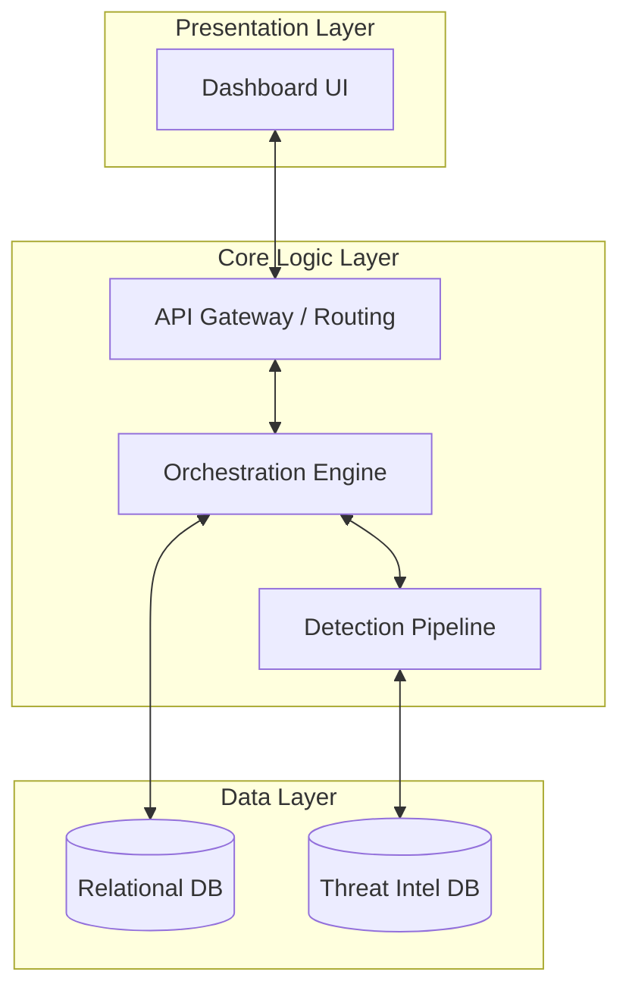

# Project Bible: AI Security Assessment & Threat Intelligence Platform

Welcome to the Project Bible. This document represents the singular source of truth for the platform's vision, architecture, standards, and strategic roadmap. It serves as a guiding light for developers, stakeholders, and architects alike.

---

## Project Vision
*Placeholder: Describe the long-term vision for the AI Security Assessment & Threat Intelligence Platform. How will this redefine how AI systems are secured, tested, and audited?*

---

## Objectives
*Placeholder: Detail the concrete key performance indicators (KPIs) and operational objectives.*
- **Objective 1**: [Describe metric or capability, e.g., real-time vulnerability scanning of LLM interactions]
- **Objective 2**: [Describe metric or capability, e.g., high-fidelity automated attack orchestration]
- **Objective 3**: [Describe metric or capability, e.g., low-latency detection of jailbreaks, prompt injections, and data exfiltration]

---

## Problem Statement
*Placeholder: Clearly define the problem space that this platform addresses. Explain the vulnerability landscape of modern AI agents, the lack of standardized attack libraries, and the difficulty of conducting digital forensics on autonomous LLM agents.*

---

## Expected Outcomes
*Placeholder: Explain the expected outcomes upon full deployment of the platform.*
- **System Outcome**: [Describe the expected operational state of a protected AI system]
- **Security Assessment Outcome**: [Describe how security audits will be simplified and automated]
- **Threat Intel Outcome**: [Describe the centralized storage and searchability of attack patterns]

---

## Overall Architecture Summary
*Placeholder: Present a high-level overview of the backend-frontend architecture, the containerization/deployment topology, database choices, and model communication paths. Keep implementation details blank or as placeholders.*

---

## Technology Stack
*Placeholder: Detail the technology stack chosen for the backend, frontend, database, and infrastructure.*

### Backend
- **Framework**: [e.g., FastAPI / Python 3.10+]
- **Async Execution**: [e.g., Asyncio / Uvicorn]
- **LLM Communication**: [e.g., Ollama client / REST interface]

### Frontend
- **Framework**: [e.g., React 19 / TypeScript]
- **Bundler & Tooling**: [e.g., Vite]
- **Styling**: [e.g., CSS Variables / Vanilla CSS]

### Storage
- **Database**: [e.g., SQLite / PostgreSQL]
- **ORM / Query Builder**: [e.g., SQLAlchemy / raw SQL / Pydantic schemas]

---

## Module Overview
*Placeholder: Introduce the ten core modules of the project, including brief functional definitions.*
1. **Module 1: Vulnerable AI Agent** - *[Completed]* - Simulated target AI agent containing typical vulnerabilities (jailbreaks, prompt injection, etc.).
2. **Module 2: Automated Attack Engine** - *[Completed]* - Orchestrator for sending structured payloads and simulating attacker behaviors.
3. **Module 3: Detection Engine** - *[Planned]* - Real-time analyzer monitoring agent inputs/outputs for malicious patterns.
4. **Module 4: Evidence Collection** - *[Planned]* - Low-overhead logging of prompts, outputs, states, and logs for security audits.
5. **Module 5: Digital Forensics** - *[Planned]* - Post-incident tooling to query, timeline, and reconstruct security events.
6. **Module 6: Attack Intelligence Database** - *[Planned]* - Centralized threat repository storing past security attacks and outcomes.
7. **Module 7: Similarity Analysis** - *[Planned]* - Vector-based or text-based clustering of incoming attacks compared against history.
8. **Module 8: Risk Prediction** - *[Planned]* - Statistical modeling to estimate probability of system compromises.
9. **Module 9: Threat Hunting** - *[Planned]* - Proactive security query engine to discover hidden vulnerabilities.
10. **Module 10: Security Dashboard** - *[Planned]* - Aggregated management console for analytics, metrics, configuration, and controls.

---

## Development Workflow
*Placeholder: Overview of local setup, pre-commit configuration, testing gates, and deployment scripts.*

---

## Coding Standards
*Placeholder: Summary of general styling guidelines (PEP 8 for Python, ES/TS guidelines for TypeScript), linting rules, and formatting commands.*

---

## Repository Structure
*Placeholder: Describe the repository folder structure, mapping key modules, configurations, and scripts.*

---

## Branch Strategy
*Placeholder: Define the git branching model (e.g., GitFlow, Trunk-Based Development).*

---

## Git Workflow
*Placeholder: Define rules for commit message structure (e.g., Conventional Commits) and the Pull Request/Code Review process.*

---

## Testing Strategy
*Placeholder: Explain the unit, integration, and end-to-end testing strategies, including testing frameworks and expected code coverage limits.*

---

## Documentation Strategy
*Placeholder: Describe how documentation is maintained, updated, and validated during development cycles.*

---

## Future Roadmap
*Placeholder: Reference the high-level roadmap and detail milestone release goals.*

---

## References
*Placeholder: List links to external standards, research papers (e.g., OWASP Top 10 for LLMs), design libraries, and documentation repositories.*
